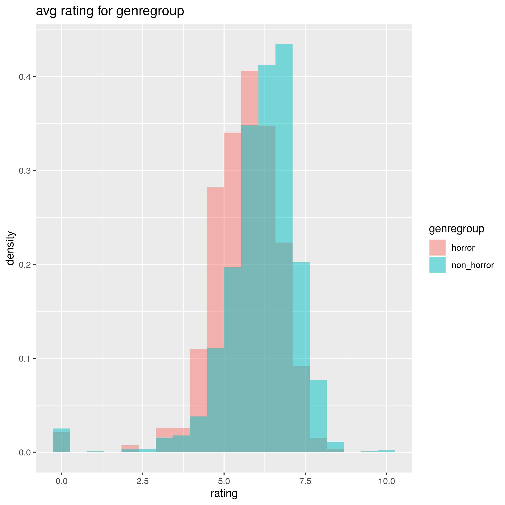

# Rating of Horror Movies

This script tests the age old question if horror movies are on average rated worse than movies from the non-horror genres. This question was raised when I was browsing the movie databases for flicks to watch. I often deemed the rating of horror movies to be unfair, while in other genres (e.g. comedy) the rating seemed to be too good. This script gives evidence that non-horror movies are in fact rated worse than other movies.

## Prerequisites

The script is written in R and requires the `ggplot2` package.

Download the dataset from kaggle: https://www.kaggle.com/tmdb/tmdb-movie-metadata Move the CSV files to the same location as `movies.R`.
